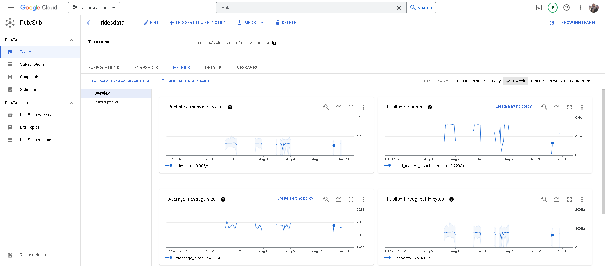
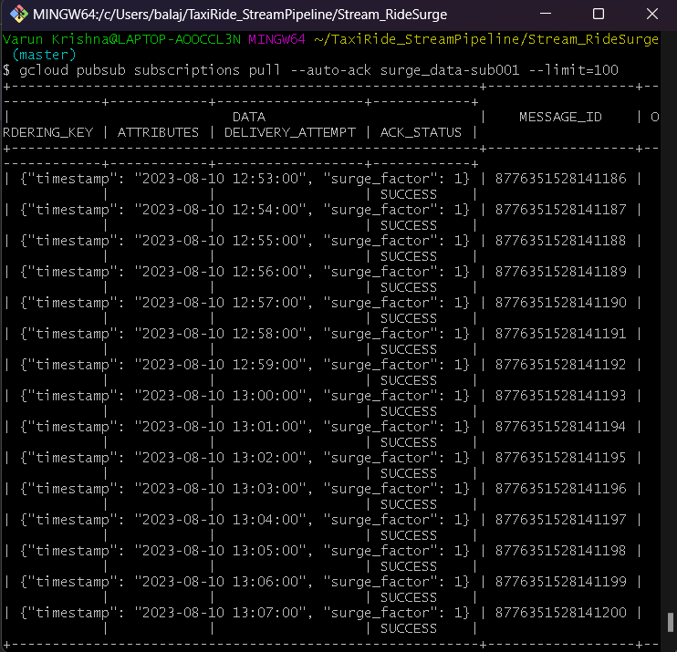

# Taxi Ride: Real-Time Data Streaming and Analysis

**In today's transportation landscape, data is pivotal for optimizing and tailoring travel experiences. In this project, I envisioned a system that could leverage the power of real-time data streaming to optimize taxi rides.**

**Every taxi ride generates a plethora of data points - from start and end locations to time taken, ride cost, and customer feedback. While this data holds immense value, its vastness and lack of structure present challenges. Traditional batch processing techniques often fall short, unable to match the dynamic nature of the data and the immediacy of insights it promises.**

> 🏗️ **This hypothetical end-to-end streaming data pipeline solution can ingest, process, and analyze taxi ride data in real-time. This offers the potential to instantly monitor and optimize various facets of the business, including dynamic pricing.**

**Here's how the project was executed:**

## Source Data : Avro, Pub/Sub

To mimic real-world taxi ride data, I employed a Python script that simulates and streams ride information in real-time to a Pub/Sub topic.

Utilizing the **`Faker`** library, I generated attributes like driver and passenger IDs, as well as start and end locations. Other key metrics such as estimated and actual ride times, costs, ratings, and ride types were also simulated, creating a dataset that effectively captures the nuances of an actual **taxi booking system**.

For optimized data transmission and processing, I utilized the **Avro** framework over traditional JSON formats. The Avro format not only assures data compactness. This choice was strategic: Avro's efficiency makes it a more cost-effective solution in terms of resources, especially when deploying the system at a large scale.

Consequently, the serialized ride data is channeled to a **Google Cloud Pub/Sub topic**. This ensures that we simulate a live stream of taxi ride data, providing a real-time data generation and broadcasting experience.

[Checkout the code](https://github.com/BVK23/TaxiRide_StreamDataflow/blob/main/TaxiRideDataGen/taxiridedata_pubsub_publisher.py)



**Screenshot of GCP Pub/Sub Topic ‘ridesdata’**

## Stream Processing : GCP Dataflow, Apache Beam, Big Query, Pub/Sub

> At the heart of this project lies real-time stream processing. Harnessing the might of Google Cloud Platform (GCP) tools coupled with Apache Beam, I targeted two main objectives:
> 

### 1. **Real-time Data Warehousing (ETL)**

> Taxi ride data, originating from our Pub/Sub topic, is channeled into a GCP Dataflow pipeline. With Apache Beam's capabilities, this pipeline efficiently filters, transforms, and loads data directly into Big Query - GCP's data warehouse.
> 

This live integration into Big Query empowers analysts to extract instant insights, enabling on-the-fly data-driven decisions. While the concept of daily batch pipelines was considered, continuous streaming proved more cost-efficient and agile solution.

In addition to the earlier transforms, we incorporate another ParDo transform that computes the **`time_difference`** and **`cost_difference`** based on the observed data. This processed data is subsequently loaded into Big Query.

[Checkout the full code](https://github.com/BVK23/TaxiRide_StreamDataflow/blob/main/TaxiRideDataGen/taxiridedata_pubsub_publisher.py)


**Screenshot of the Query fetching records from the ‘rides’ table that holds the streamed data**

### 2. **Dynamic Ride Pricing based on Surge Factor**

With the world moving at breakneck speed, dynamic pricing is instrumental in maintaining equilibrium between demand and supply. I formulated a 'Surge Factor' by analyzing real-time ride requests against taxi availability. A pronounced surge factor indicates higher demand, suggesting an opportune moment for a slight uptick in pricing.

> This surge factor, determined in real-time within the Dataflow pipeline, is then broadcasted to a separate Pub/Sub topic. An API, responsible for deciding ride prices, listens to this topic.
> 

As a result, I've ensured ride prices adapt in real-time to live demand-supply scenarios, elevating business revenue and refining passenger experience.

As observed, the pipeline for this use case shares similarities with the DWH use case up to the data deserialization step. Post this, we segment the data into 5-minute sliding windows, refreshing every minute. This approach allows us to adeptly capture any surge in rides by monitoring the ride count within a 5-minute bracket, and accordingly fine-tune our surge factor every minute to recalibrate ride prices in our taxi system.

[Checkout the full code](https://github.com/BVK23/TaxiRide_StreamDataflow/blob/main/Stream_RideSurge/RideSurge_TaxiRide.py)



**Screenshot of the output of data streamed to Pub/Sub for dynamically adjusting price**

During my evaluations, I closely monitored both the processing and event times of our windowed streaming data. The results were promising.  I executed the streaming pipeline for a new subscription under the under the topic (source data), so that as soon I deploy/run the pipeline there is no delay in processing data. 

However, as with any real-world application, we must prepare for contingencies—like late data arrivals. Simulating such nuances requires intricate effort.

<details>
  <summary>Click to expand!</summary>
  
  This is the content inside the dropdown. It can be anything: text, images, code blocks, etc.

  ```python
  print("Hello from inside the dropdown!")
  ```
</details>

