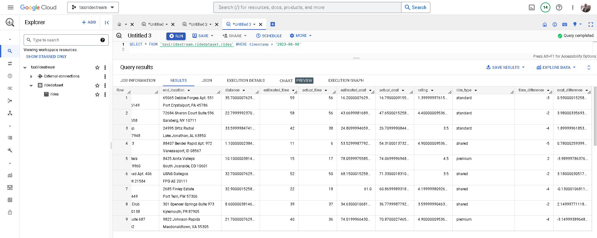
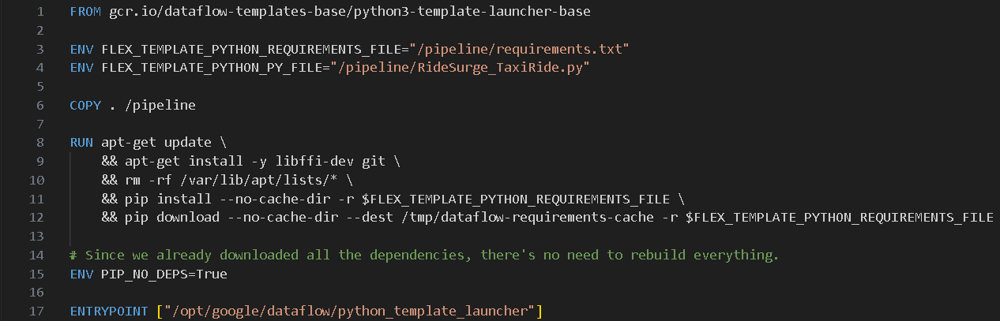
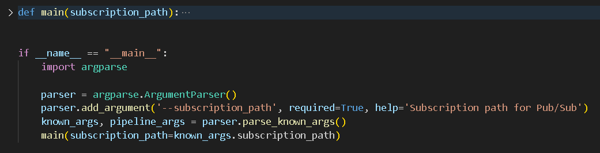
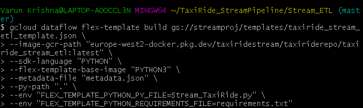
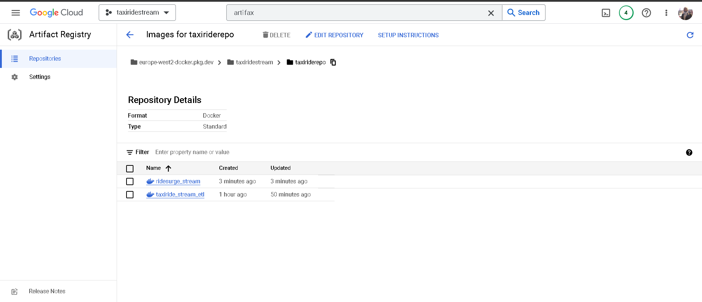
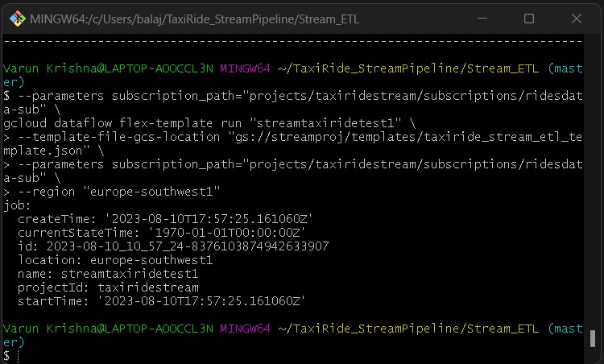
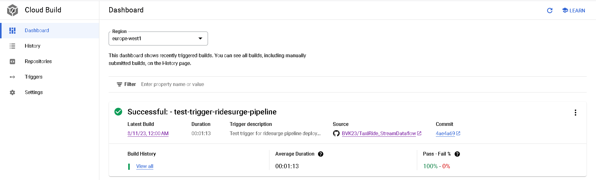
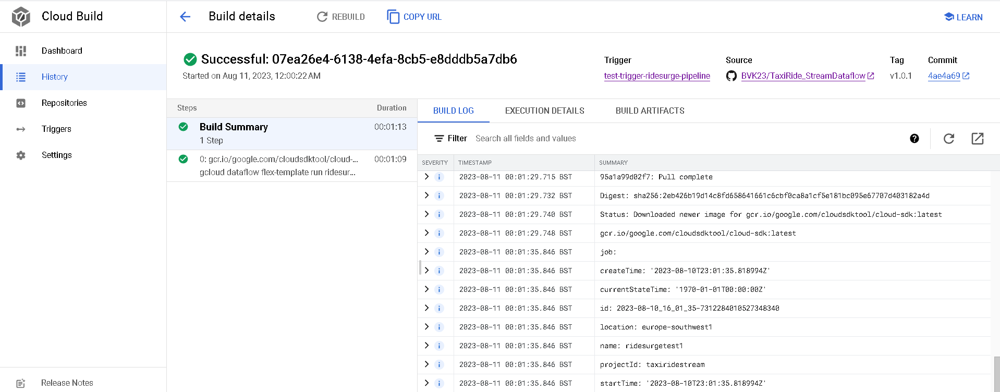
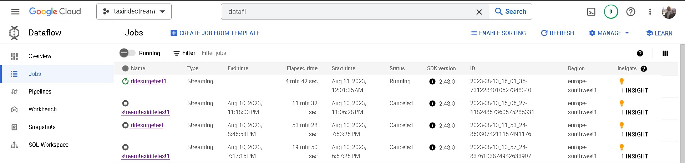

# Taxi Ride: Real-Time Data Streaming and Analysis

**In today's transportation landscape, data is pivotal for optimizing and tailoring travel experiences. In this project, I envisioned a system that could leverage the power of real-time data streaming to optimize taxi rides.**

**Every taxi ride generates a plethora of data points - from start and end locations to time taken, ride cost, and customer feedback. While this data holds immense value, its vastness and lack of structure present challenges. Traditional batch processing techniques often fall short, unable to match the dynamic nature of the data and the immediacy of insights it promises.**

> 🏗️ **This hypothetical end-to-end streaming data pipeline solution can ingest, process, and analyze taxi ride data in real-time. This offers the potential to instantly monitor and optimize various facets of the business, including dynamic pricing.**

**Here's how the project was executed:**

  
<h2> Source Data : Avro, Pub/Sub </h2>

To mimic real-world taxi ride data, I employed a Python script that simulates and streams ride information in real-time to a Pub/Sub topic.

Utilizing the **`Faker`** library, I generated attributes like driver and passenger IDs, as well as start and end locations. Other key metrics such as estimated and actual ride times, costs, ratings, and ride types were also simulated, creating a dataset that effectively captures the nuances of an actual **taxi booking system**.

For optimized data transmission and processing, I utilized the **Avro** framework over traditional JSON formats. The Avro format not only assures data compactness. This choice was strategic: Avro's efficiency makes it a more cost-effective solution in terms of resources, especially when deploying the system at a large scale.

Consequently, the serialized ride data is channeled to a **Google Cloud Pub/Sub topic**. This ensures that we simulate a live stream of taxi ride data, providing a real-time data generation and broadcasting experience.

[Checkout the code](https://github.com/BVK23/TaxiRide_StreamDataflow/blob/main/TaxiRideDataGen/taxiridedata_pubsub_publisher.py)

*Screenshot of GCP Pub/Sub Topic ‘ridesdata’*

  
<h2> Stream Processing : GCP Dataflow, Apache Beam, Big Query, Pub/Sub </h2>

> At the heart of this project lies real-time stream processing. Harnessing the might of Google Cloud Platform (GCP) tools coupled with Apache Beam, I targeted two main objectives:
> 

### 1. **Real-time Data Warehousing (ETL)**

> Taxi ride data, originating from our Pub/Sub topic, is channeled into a GCP Dataflow pipeline. With Apache Beam's capabilities, this pipeline efficiently filters, transforms, and loads data directly into Big Query - GCP's data warehouse.
> 

This live integration into Big Query empowers analysts to extract instant insights, enabling on-the-fly data-driven decisions. While the concept of daily batch pipelines was considered, continuous streaming proved more cost-efficient and agile solution.

In addition to the earlier transforms, we incorporate another ParDo transform that computes the **`time_difference`** and **`cost_difference`** based on the observed data. This processed data is subsequently loaded into Big Query.

[Checkout the full code](https://github.com/BVK23/TaxiRide_StreamDataflow/blob/main/TaxiRideDataGen/taxiridedata_pubsub_publisher.py)

*Screenshot of the Query fetching records from the ‘rides’ table that holds the streamed data*

### 2. **Dynamic Ride Pricing based on Surge Factor**

With the world moving at breakneck speed, dynamic pricing is instrumental in maintaining equilibrium between demand and supply. I formulated a 'Surge Factor' by analyzing real-time ride requests against taxi availability. A pronounced surge factor indicates higher demand, suggesting an opportune moment for a slight uptick in pricing.

> This surge factor, determined in real-time within the Dataflow pipeline, is then broadcasted to a separate Pub/Sub topic. An API, responsible for deciding ride prices, listens to this topic.
> 

As a result, I've ensured ride prices adapt in real-time to live demand-supply scenarios, elevating business revenue and refining passenger experience.

As observed, the pipeline for this use case shares similarities with the DWH use case up to the data deserialization step. Post this, we segment the data into 5-minute sliding windows, refreshing every minute. This approach allows us to adeptly capture any surge in rides by monitoring the ride count within a 5-minute bracket, and accordingly fine-tune our surge factor every minute to recalibrate ride prices in our taxi system.

[Checkout the full code](https://github.com/BVK23/TaxiRide_StreamDataflow/blob/main/Stream_RideSurge/RideSurge_TaxiRide.py)

*Screenshot of the output of data streamed to Pub/Sub for dynamically adjusting price*

During my evaluations, I closely monitored both the processing and event times of our windowed streaming data. The results were promising.  I executed the streaming pipeline for a new subscription under the under the topic (source data), so that as soon I deploy/run the pipeline there is no delay in processing data. 

However, as with any real-world application, we must prepare for contingencies—like late data arrivals. Simulating such nuances requires intricate effort.

  
<h2>Flex Template and Containerised Deployment:  </h2>

###Docker, Artifact Registry, Cloud CLI    
> In pursuit to make the streaming project not just effective but also scalable and maintainable, I employed Dataflow flex templates and containerized deployment.
> 
    
By employing a Flex template, I packaged the pipeline as a Docker image in Artifact Registry. The template specification, stored in Cloud Storage, points to this Docker image. On initiating the template, the Dataflow service kickstarts a launcher VM, retrieves the Docker image, and gets the pipeline running.

*The Docker File*

Docker's encapsulation feature provides us with an isolated, consistent environment for our Dataflow pipeline, making it ideal for replicable deployments across various stages of our project.

Designed for versatility, my pipeline isn't tethered to any specific Pub/Sub subscription. It leans on Python's argparse module and metadata-defined parameters, ensuring users provide the **`--subscription_path`** argument, indicating the intended Pub/Sub subscription.

*Configurable Subscription Path*

This design ensures maximum flexibility. Whether we're running tests using one subscription or deploying in a production scenario with another, the pipeline remains consistent. Users/Devs only need to specify the appropriate subscription when triggering the pipeline.

[Check the Metadata file used for creating the template](https://github.com/BVK23/TaxiRide_StreamDataflow/blob/main/Stream_ETL/metadata.json) 

*Flex template creation*

*Docker Images at Artifact Registry*

  
<h2> CI/CD and Cloud Build </h2>

    
> To augment the resilience and adaptability of our Taxi Ride streaming project, the integration of Continuous Integration and Continuous Delivery (CI/CD) was paramount. Google Cloud Build was our chosen mechanism to round off this comprehensive Data Engineering Project.
> 

A simple Google Cloud CLI command will set our flex template into a Dataflow job.

*Command to run our Dataflow flex template job.*

However, the real challenge lay in incorporating this seamlessly into our test and production environments and CI/CD cycle. I drafted a **`cloudbuild.yaml`** file, which delineates the steps for building the Docker image, creating the flex template, and subsequently kickstarting the job.

[cloudbuild.yaml file](https://github.com/BVK23/TaxiRide_StreamDataflow/blob/main/Stream_ETL/metadata.json) 

The inherent compatibility of Google Cloud Build with version control systems like GitHub facilitated the automatic deployment of our pipeline upon the push of a new tag.

The schematic representation of our CI/CD setup with Google Cloud Build is as follows:

1. **Source Control**: Developers seamlessly commit and push their code updates to GitHub.
2. **Trigger Activation**: The act of pushing a new tag, such as v1.0.1, activates the Cloud Build trigger.
3. **Automated Build & Test**: Cloud Build, in its prowess, fetches the code, and adhering to the blueprint provided by the **`cloudbuild.yaml`** file, runs the build. The initial tests are executed within a test environment/project.
4. **Deployment**: Post successful tests, we trigger the build for production, releasing the updated application.

**Our Build Test illustrated below:**

*Screenshot of Cloud Build Dashboard*

*Shows that our trigger succeeded once we pushed the changes and new tag to our repo.*

*Successful build and the pipeline is deployed on Dataflow*

> The Taxi Ride Streaming Project stands testament to the amalgamation of requisite skills, strategic foresight, and hands-on technical knowledge of Google Cloud, CI/CD etc. For a private hire and taxi company on the brink of innovation and expansion, this project embodies the ideal blend of technical expertise and business acumen required for the role of a Data Engineer.
> 